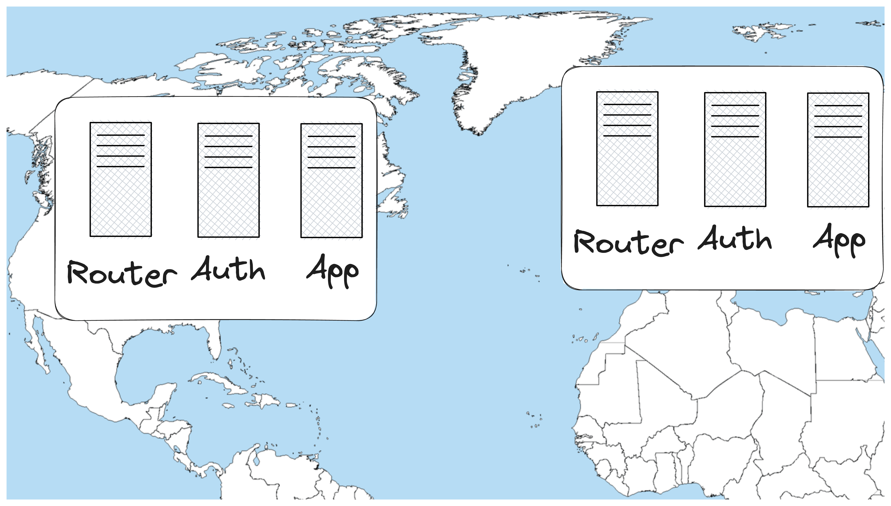
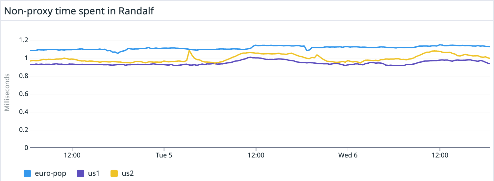

<style>
  :root {
    color: black;
    background: white;
  }

  h1, h2, h3 {
    font-weight: 300;
    color: black;
  }

  a {
    color: black
    font-weight: 200;
  }

  h1 {
    text-align: center;
    font-size: 60px;
  }

  h2 {
    font-size: 40px;
  }

  pre, code {
    background-color: white;
    color: black;
  }

</style>


# Building a Globally Distributed Router in Elixir

---


## Why did we, and why might you need a router?

---

## One server in europe and one server in the USA.

---


---


---


---



---


## Requirements

- Can route a request to the correct region.

---


## Requirements

- Can route a request to the correct region.
- Source of truth for unique email and to which team that email belongs.

---


## Requirements

- Can route a request to the correct region.
- Source of truth for unique email and to which team that email belongs.
- Fast Lookups for routing.

---


## Approach

<!-- 8m -->

- Reverse Proxy.

---


---


## Approach

- Reverse Proxy.
- Single Postgres database in one region, this solves uniqueness.

---


## Approach

- Reverse Proxy.
- Single Postgres database in one region, this solves uniqueness.
- ETS cache in all regions, transported by Kafka, this solves fast lookups.

---


## Elixir Strengths

<!-- 14m -->

- Holding on to Connections

---


## Elixir Strengths

- Holding on to Connections
- Plug places the pit of success right in front of you.

---


## Falling in the pit of success, in our `router.ex` file.

```elixir
  pipeline :gandalf_proxy do
    plug(RegionDataAdder)
    plug(RegionAdder)
    plug(Parser)
    plug(Proxy)
    plug(SamlNameIdComparer)
    plug(Response)
  end
```

---


## Elixir Strengths

- Holding on to Connections.
- Plug places the pit of success right in front of you.
- Adds minimal latency.

---



---


## Pitfalls

- Hop-by-hop headers

---


## Pitfalls

- Hop-by-hop headers
- Flexing how much we can do with very little resources

---


## Pitfalls

- Hop-by-hop headers
- Flexing how much we can do with very little resources
- We could not cut any scope, and the project took longer than expected.

---

## Now What?

- Build a proxy, it will be easy.

---

## Now What?

- Build a proxy, it will be easy.
- If you need to build a router, consider how many different types of requests you need to route.
